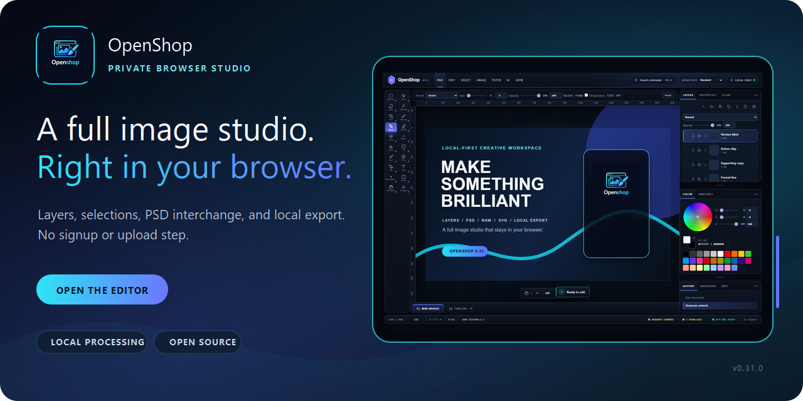
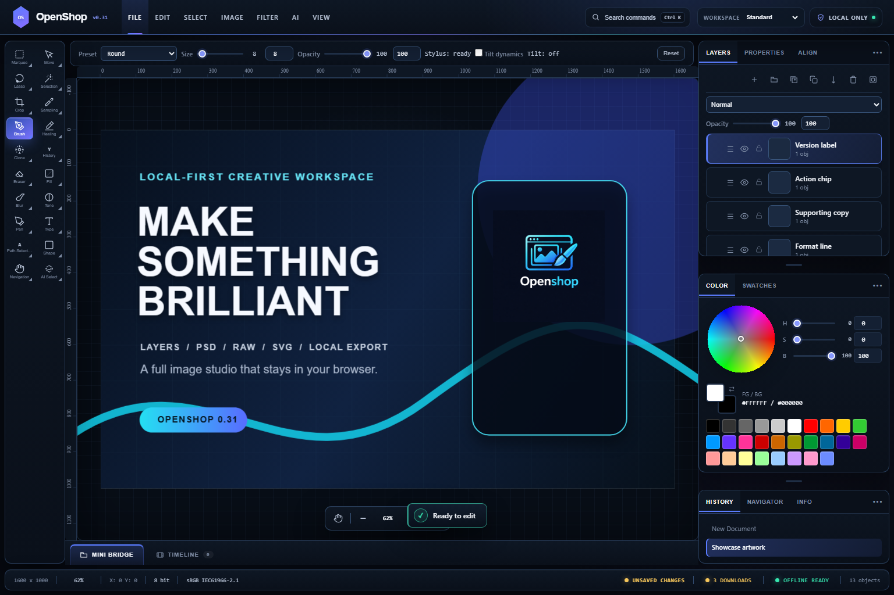
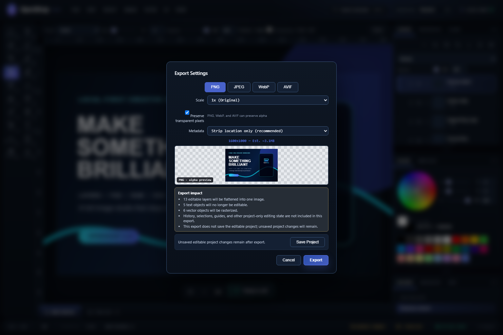
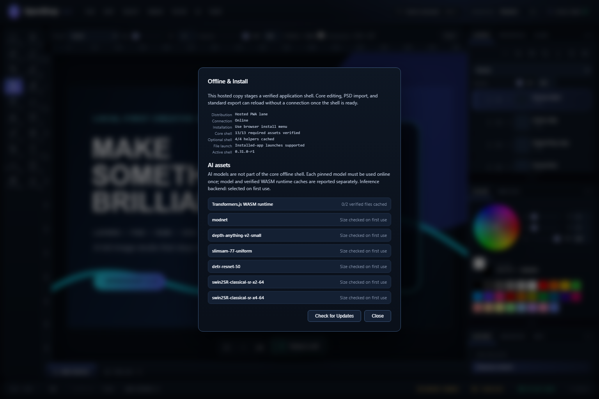
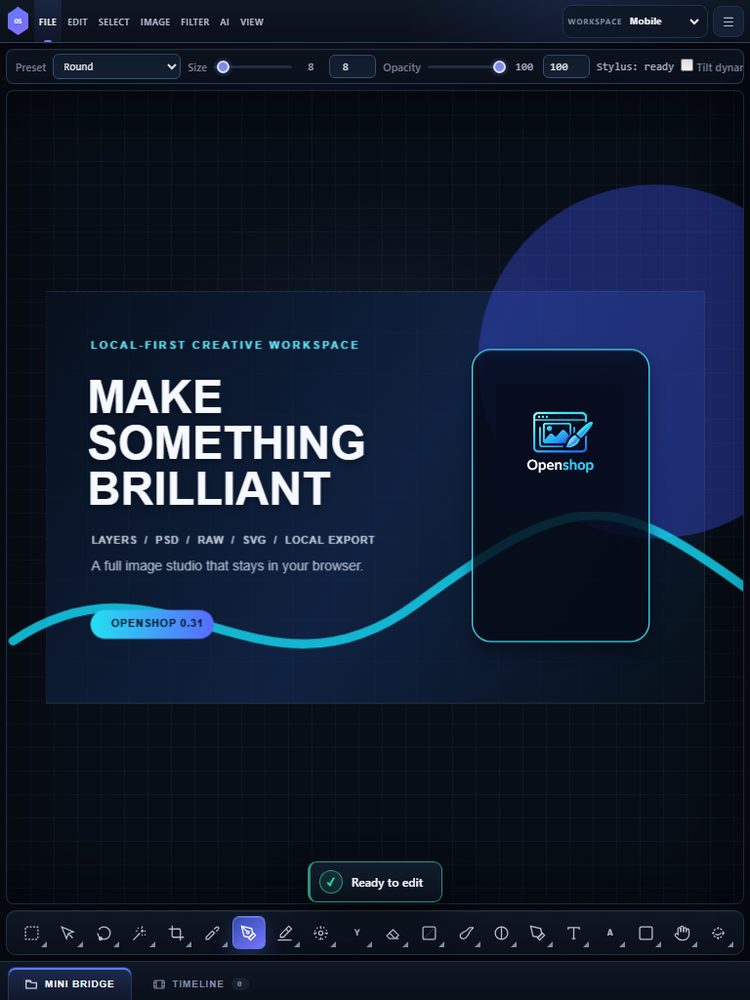

# OpenShop

[](https://github.com/SysAdminDoc/Openshop/releases/latest)
[](LICENSE)
[](https://sysadmindoc.github.io/Openshop/)
[](https://sysadmindoc.github.io/Openshop/)



OpenShop is an open-source browser image editor for layered work, PSD interchange, precise selections, and local export. Open it online, install the hosted app, or keep the single HTML file nearby. There is no account and no editing server.

[**Open the editor**](https://sysadmindoc.github.io/Openshop/) · [Download the latest release](https://github.com/SysAdminDoc/Openshop/releases/latest) · [See supported formats](docs/FORMATS.md)

## See it in action

| Layered editing workspace | Export preview and compatibility report |
|---|---|
|  |  |
| **Verified offline shell** | **Compact workspace** |
|  |  |

These images come from OpenShop itself. Run `npm run marketing:capture` to rebuild them in headless Chromium.

## Why OpenShop

- Your pixels stay in the browser during normal editing. OpenShop has no telemetry, upload endpoint, account system, or credit meter.
- Layers are real working structure, not a decorative panel. Groups, masks, adjustment layers, editable text, vectors, and embedded Smart Objects survive in the native project format.
- Open common web formats plus PSD, OpenRaster, PDF, camera RAW files, HEIC, and JPEG XL. Export settings tell you what a target format cannot preserve before you save.
- It travels well. Use one HTML file for a portable network-first editor, or install the hosted PWA after its status reads **Offline ready**.

## What you can do

| Area | Highlights |
|---|---|
| **Draw and retouch** | Brush presets, imported ABR tips, pencil, clone stamp, healing, dodge, burn, smudge, shapes, gradients, and symmetry modes |
| **Select precisely** | Marquee, lasso, magnetic lasso, Quick Selection, Magic Wand, Color Range, Refine Edge, feathering, and pixel masks |
| **Build layered artwork** | Nested groups, raster masks, adjustment layers, editable vectors, per-range text styling, blend modes, and drag reordering |
| **Transform without guesswork** | Crop, perspective crop, resize, rotate, skew, warp, guides, rulers, snapping, and pixel-perfect zoom |
| **Edit with a safety net** | 120-step undo history, named snapshots, recoverable branches, browser recovery storage, and explicit dirty-state reporting |
| **Automate repeat work** | Record validated actions, replay them atomically, or process a folder into a path-preserving ZIP |
| **Use optional local models** | Background removal, depth maps, object detection, click-guided segmentation, and 2x or 4x enlargement run in the browser after their first download |
| **Extend or embed it** | A capability-limited plugin sandbox and a versioned host bridge support controlled integrations |

OpenShop currently exposes 34 editing tools. Heavy filters run off the main thread, and supported operations can use WebGPU or WebGL2 when the browser passes capability checks.

## Format support

| Workflow | Formats |
|---|---|
| **Import and export** | PNG, JPEG, WebP, AVIF, SVG, PDF, PSD, OpenRaster, GIF, and OpenShop projects |
| **Import** | APNG, HEIC/HEIF, JPEG XL, BMP, and camera RAW formats |
| **Reusable assets** | ASE and GPL palettes, ABR brushes, GRD gradients, plus OpenShop JSON assets |

Some formats cannot carry every editable feature. PSD supports pixel layers, nested groups, common blend settings, basic text, and profile metadata. OpenRaster keeps its supported layer stack. SVG imports supported shapes, text, groups, and text spans as editable objects. The export dialog names rasterization and flattening before writing a file.

Read the [format and compatibility guide](docs/FORMATS.md) for animation behavior, metadata handling, and exact loss boundaries.

## Start editing

### Use the hosted editor

Visit [sysadmindoc.github.io/Openshop](https://sysadmindoc.github.io/Openshop/). On supported browsers, use the install option after the offline panel confirms the core shell is ready.

### Keep the portable file

Download `index.html` and open it in a modern browser. A cold launch needs a connection because three integrity-checked core libraries are fetched from a pinned CDN. Browsers do not permit a service worker on the `file://` lane.

### Self-host the installable app

Serve these files together from a dedicated HTTPS subdirectory:

```text
index.html
plugin-sandbox.html
plugin-sandbox.js
sw.js
manifest.webmanifest
icon.png
icon-192.png
icon-512.png
design/openshop-social-preview.png
design/openshop-studio-master.png
design/openshop-menu-states.png
```

Keep `sw.js` below the application path so it cannot control unrelated pages on the same origin.

## Privacy without vague promises

Normal editing, filters, recovery, and export happen on your device. The Network Activity panel records outbound requests from the moment the page starts.

OpenShop downloads pinned program code from `cdn.jsdelivr.net`. Optional model weights come from Hugging Face when you first use a model-backed feature. Those resources can be cached for later use. If you deliberately start a Collaborative Session, the selected document state is sent directly to the peer you connect over WebRTC.

Strict Offline Mode blocks requests that are not already available locally. For a cold offline start, use the hosted app only after it reports **Offline ready**. The standalone HTML file is network-first on its first run.

Read [SECURITY.md](SECURITY.md) for the trust boundaries, cache behavior, and private vulnerability-reporting link.

## Browser support

| Browser | Core editing | Hosted install and recovery | Verification |
|---|---:|---:|---|
| Chrome and Edge 90+ | Yes | Best support | Chromium desktop, hosted, offline, and narrow-view tests |
| Firefox 90+ | Yes | Feature-dependent | Firefox desktop and mobile-emulation tests |
| Safari 15+ and WebKit | Yes | Feature-dependent | WebKit desktop and mobile-emulation tests |

Mobile layouts are covered with browser emulation. Physical Android, iOS, and pen hardware are not release claims yet.

## Documentation

- [Formats and compatibility](docs/FORMATS.md)
- [Development and local release checks](docs/DEVELOPMENT.md)
- [Security and privacy model](SECURITY.md)
- [Changelog](CHANGELOG.md)

## Development

The shipped editor has no Node.js runtime dependency. Contributors need Node.js 22.22.2 or newer for the local test tools.

```bash
npm ci
npm test
npm run test:e2e
npm run test:release
```

There is no remote build pipeline. The complete release gate runs locally. See [docs/DEVELOPMENT.md](docs/DEVELOPMENT.md) before changing inline scripts, pinned runtime assets, service-worker files, or visual baselines.

<details>
<summary>Runtime package and license inventory</summary>

Every executable runtime URL is version-pinned and integrity-checked. Tests keep this table synchronized with the canonical manifest.

| Package | Version and license | Purpose |
|---|---|---|
| Fabric.js | `fabric` 7.4.0 (MIT) | Canvas objects and optional gradient controls |
| ImageTracer | `imagetracerjs` 1.2.6 (Unlicense) | Raster-to-vector tracing |
| svg2pdf.js | `svg2pdf.js` 2.7.0 (MIT) | Vector PDF output |
| ag-psd | `ag-psd` 31.0.2 (MIT) | PSD import and export |
| jsPDF | `jspdf` 4.2.1 (MIT) | PDF generation |
| modern-gif | `modern-gif` 2.1.0 (MIT) | Animated GIF import and export |
| PDF.js | `pdfjs-dist` 6.2.108 (Apache-2.0) | PDF import |
| LibRaw-Wasm | `libraw-wasm` 1.6.0 (ISC) | Camera RAW decoding |
| Transformers.js | `@huggingface/transformers` 4.2.0 (Apache-2.0) | Browser-local model inference |
| Photon | `@silvia-odwyer/photon` 0.3.3 (Apache-2.0) | Optional WASM filter acceleration |
| jSquash AVIF | `@jsquash/avif` 2.1.1 (Apache-2.0) | AVIF decoding and encoding |
| jSquash HEIC | `@discourse/heic` 1.0.0 (Apache-2.0) | HEIC and HEIF decoding fallback |
| jSquash JPEG XL | `@jsquash/jxl` 1.3.0 (Apache-2.0) | JPEG XL decoding fallback |
| ONNX Runtime Web | `onnxruntime-web` 1.26.0-dev.20260416-b7804b056c (MIT) | WASM model runtime |
| C2PA web | `@contentauth/c2pa-web` 0.13.4 (MIT) | Content Credentials reader |
| C2PA WebAssembly | `@contentauth/c2pa-wasm` 0.11.2 (MIT) | Content Credentials verification |
| highgain | `highgain` 0.1.0 (ISC) | C2PA worker transport |
| ts-deepmerge | `ts-deepmerge` 8.0.0 (ISC) | C2PA reader settings merge |

</details>

## Contributing

Bug reports and focused pull requests are welcome. Include a reproducible sample, the browser version, and whether the app was opened from disk or served over HTTPS. Run the local release gate before submitting a change.

## License

[MIT](LICENSE) © 2026 Matthew Parker
